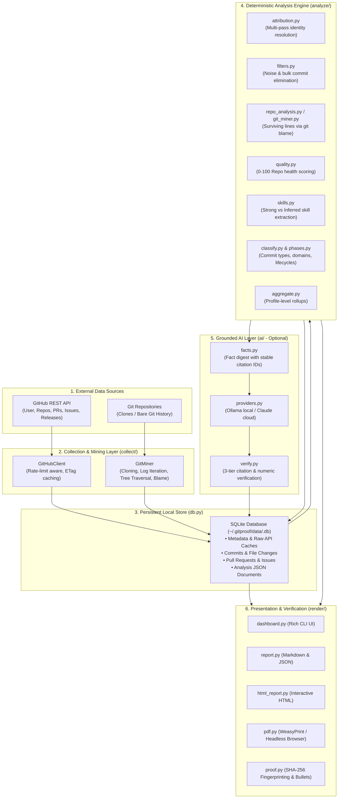

# GitProof System Architecture

GitProof is designed as a **local-first, deterministic, evidence-grounded engine** that transforms GitHub activity and mined git repository histories into verifiable developer profiles and proof-of-work reports.

This document details the architectural structure, data pipeline, module responsibilities, storage models, and security principles.

---

## 1. High-Level Architecture Overview

GitProof decouples data collection, mining, deterministic analysis, AI summarization (optional), and multi-format rendering into distinct layers.



---

## 2. Core Subsystems and Modules

### 2.1 CLI Layer (`src/gitproof/cli.py`)
- Built using **Typer** and styled with **Rich**.
- Provides commands: `analyze`, `show`, `export`, `summarize`, `ask`, `bullets`, `verify`, `config`, and `cache clear`.
- Handles command execution, configuration loading, interactive prompts (e.g. cloud AI consent), progress spinners, and terminal output formatting.

### 2.2 Configuration Management (`src/gitproof/config.py`)
- Configuration file stored at `~/.gitproof/config.toml` (or custom `$GITPROOF_HOME`).
- Permission enforced to `0600` (read/write only by the user) to protect GitHub and API tokens.
- Manages:
  - GitHub Personal Access Tokens (`token`).
  - User aliases (`aliases`: additional emails/names).
  - Mining limits (`max_repo_size_mb`, `max_commits_per_repo`, `blame_max_files`).
  - AI configurations (`ai_provider`, `ai_model`, `claude_model`, `ollama_host`, `claude_consent`).

### 2.3 Storage Layer (`src/gitproof/db.py`)
- SQLite storage engine per GitHub username: `~/.gitproof/data/<login>.db`.
- Operates in **WAL (Write-Ahead Logging)** mode with normalized pragmas (`synchronous=NORMAL`, `busy_timeout=10000`).
- **Database Schema**:
  - `meta (key TEXT PRIMARY KEY, value TEXT)`: Configuration, profile metadata, learned identities, timestamp.
  - `repos (full_name TEXT PRIMARY KEY, ...)`: Repository metadata, push timestamps, analysis statuses (`ok`, `skipped`, `empty`, `error`), and `mined_key` cache invalidation tokens.
  - `commits (repo TEXT, sha TEXT, author_name TEXT, author_email TEXT, authored_at TEXT, is_merge INTEGER, subject TEXT, is_user INTEGER, additions INTEGER, deletions INTEGER, files_changed INTEGER, PRIMARY KEY (repo, sha))`: Indexed by `(repo, is_user)` and `authored_at`.
  - `commit_files (repo TEXT, sha TEXT, path TEXT, additions INTEGER, deletions INTEGER)`: Granular file-level modifications by the user.
  - `items (kind TEXT, repo TEXT, number INTEGER, title TEXT, state TEXT, merged INTEGER, created_at TEXT, closed_at TEXT, html_url TEXT, is_external INTEGER, PRIMARY KEY (kind, repo, number))`: PRs and Issues authored by the user.
  - `releases (repo TEXT, tag TEXT, name TEXT, published_at TEXT, html_url TEXT, kind TEXT, PRIMARY KEY (repo, tag))`.
  - `analysis (kind TEXT, key TEXT, data TEXT, updated_at TEXT, PRIMARY KEY (kind, key))`: Serialized analysis documents (`snapshot`, `blame`, `repo`, `profile`, `ai_summary`, `ai_ask`).
  - `http_cache (url TEXT PRIMARY KEY, etag TEXT, data TEXT, expires_at TEXT)`: API cache with ETag validation.

### 2.4 Data Collection & Git Mining Layer (`src/gitproof/collect/`)
- **`github_api.py` (`GitHubClient`)**:
  - Resilient HTTP client using `httpx`.
  - Proactively tracks API budgets and rate-limit headers (`X-RateLimit-Remaining`, `X-RateLimit-Reset`).
  - Graceful degradation: if search quota or release endpoint quota is low, it falls back to git tags and local commits without failing.
  - Caches repository listings, user profiles, and items.
- **`git_miner.py`**:
  - Executes local `git` operations directly against bare repositories located in `~/.gitproof/clones/`.
  - Efficiently executes `git clone --bare --filter=blob:none` (or full clone fallback) and `git fetch`.
  - Parses `git log` streams with author dates, merge status, and `--numstat`.
  - Extracts repository tree snapshots at `HEAD` using `git ls-tree -r -l`.
  - Streams `git blame --line-porcelain` to accurately attribute surviving lines to exact author commits.

### 2.5 Deterministic Analysis Engine (`src/gitproof/analyze/`)
- **`attribution.py`**: Multi-signal identity resolution engine.
- **`filters.py`**: Rule-based noise removal (lockfiles, vendor directories, build artifacts, generated code, binary/asset formats, and bulk import detection).
- **`quality.py`**: 100-point repository engineering health index.
- **`skills.py`**: Discovers languages, frameworks, libraries, tools, and platforms from touched files and edited dependency manifests.
- **`classify.py`**: Classifies commit messages (features, bug fixes, refactoring, tests, docs, tooling) and maps file paths to engineering domains (Backend/API, UI, ML/Data, Security, Networking, Database, Platform, CI/DevOps, Testing, Build/Config, Documentation).
- **`phases.py`**: Maps project activity into lifecycle phases (Initial creation, Active development, Stabilization, Maintenance, Revisit).
- **`repo_analysis.py`**: Aggregates all mined repository data into a cohesive repository report.
- **`aggregate.py`**: Aggregates all repository reports into a holistic developer profile.

### 2.6 Grounded AI Subsystem (`src/gitproof/ai/`)
- **Zero Hallucination Policy**: AI is strictly optional and strictly evidence-grounded.
- **`facts.py`**: Converts raw metrics and repository metadata into isolated, structured `Fact` objects with immutable citation identifiers (e.g. `repo:...`, `c:<sha>`, `pr:...`, `rel:...`, `skill:...`, `phase:...`).
- **`providers.py`**: Connects to local **Ollama** (offline) or **Claude** via Anthropic API (explicit opt-in).
- **`verify.py`**: Enforces strict verification. Discards any AI claim that lacks citations, invents numbers not present in the fact digest, or fails lexical token grounding.

### 2.7 Rendering & Export Subsystem (`src/gitproof/render/`)
- **`dashboard.py`**: Rich terminal interface with summary cards, language distribution, top projects table, and repository deep dives.
- **`report.py`**: Deterministic Jinja2 markdown report rendering and structured JSON exporter.
- **`html_report.py`**: Beautiful, responsive, standalone single-file HTML report with interactive filters, expandable commit details, and embedded SVG styling.
- **`pdf.py`**: PDF generator supporting **WeasyPrint** (recommended) or **Headless Chrome/Edge/Chromium**.
- **`proof.py`**: Canonicalizes output JSON and computes SHA-256 tamper-evident digital fingerprints. Generates factual resume bullet points and LinkedIn summaries.

---

## 3. Data Pipeline Lifecycle

```
[Start: gitproof analyze <username>]
  │
  ├─► 1. Identity Initialization: Probe user on GitHub, fetch user profile & aliases.
  │
  ├─► 2. Repository Discovery: Fetch user repositories (public + optional private).
  │
  ├─► 3. Identity Learning: Scan user-authored commits across repositories to harvest emails & names.
  │
  ├─► 4. Repository Mining Loop (for each repo):
  │     ├─► Check Cache: Match mined_key (pushed_at, since, identity fingerprint, blame flag).
  │     ├─► Clone / Fetch: Bare git clone to ~/.gitproof/clones/<owner>__<repo>.git.
  │     ├─► Parse Git Log: Commit subjects, timestamps, author match, numstat.
  │     ├─► Snapshot HEAD: File tree, README, dependency manifests (package.json, pyproject.toml, etc.).
  │     ├─► Blame Analysis: Measure surviving lines written by the user on default branch.
  │     ├─► Release Collection: Fetch GitHub releases (or git tags fallback).
  │     └─► Repository Assembly: Classify commits, calculate quality score (0-100), extract skills.
  │
  ├─► 5. Profile Aggregation:
  │     ├─► Aggregate commit counts, surviving lines, active calendar days, language breakdown.
  │     ├─► Calculate primary focus areas (Web, Mobile, Systems, ML/AI, Security, Cloud, etc.).
  │     ├─► Compute open-source impact (external PRs, reviews, issues).
  │     └─► Persist profile analysis document to SQLite.
  │
  └─► 6. Render / Output:
        ├─► Render Terminal Dashboard.
        └─► Ready for instant export to MD, HTML, JSON, or PDF.
```

---

## 4. Privacy and Security Model

1. **Local-First Processing**:
   - All git operations, SQLite databases, and analyses execute on the local workstation.
   - Raw source code stays on the local machine in `~/.gitproof/clones/`.
2. **Credential Safety**:
   - `~/.gitproof/config.toml` is written with strict filesystem permissions (`chmod 0600`).
   - Tokens are passed via memory headers or secure environment variables, never hardcoded in git clone URLs.
   - Git remote URLs in bare clones strip embedded credentials.
3. **AI Data Minimization**:
   - By default, AI uses **local Ollama** where no data leaves the machine.
   - If using cloud provider (Claude), only compact metadata digests (commit subjects, PR titles, technology names, counts) are transmitted. **Source code, file bodies, and email addresses are never sent to AI providers.**
   - Cloud AI requests require explicit user confirmation and show the exact token footprint before transmission.
4. **Tamper-Evident Verification**:
   - JSON export includes a SHA-256 hash computed over canonicalized profile and repository objects.
   - Anyone receiving a `*-proof-of-work.json` file can run `gitproof verify report.json` to verify that not a single number, commit count, or metric was modified after export.
