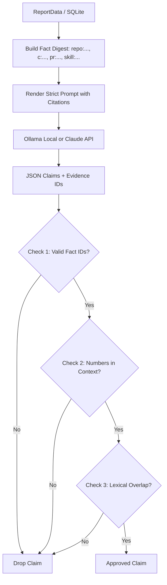

# How GitProof Works: Deep Dive into Mechanics & Algorithms

GitProof eliminates fluff, vanity metrics, and self-reported resume claims by replacing them with **deterministic, evidence-backed proof of work**.

This document explains the algorithms, filtering logic, metrics computation, AI verification system, and cryptographic verification mechanisms powering GitProof.

---

## 1. Identity Resolution & Multi-Pass Attribution

One of the hardest problems in git analytics is matching commits when developers use different email addresses, multiple machines, or default GitHub noreply masks.

GitProof implements a multi-signal identity matching model in `src/gitproof/analyze/attribution.py`:

```
Identity Resolution Signals:
1. Canonical GitHub login (case-insensitive)
2. User profile name & public profile email
3. Configured user aliases (`gitproof config --alias ...` or `--alias`)
4. GitHub noreply address pattern: `^(?:\d+\+)?login@users.noreply.github.com$`
5. Learned commit emails: Scanned from author commits across user repositories via GitHub API
6. Author name matching (Restricted to non-fork repositories owned by the user to avoid collision in large OSS projects)
```

### Identity Matching Rule:
```python
def matches(self, email: str, name: str, allow_name: bool = False) -> bool:
    e = (email or "").strip().lower()
    if e in self.emails:
        return True
    if is_github_noreply_for_user(e, self.login):
        return True
    return allow_name and (name or "").strip().lower() in self.names
```

---

## 2. Noise Filtering & Bulk Import Elimination

Raw git commit statistics (`git log --stat` or lines added) are easily distorted by package lockfiles, vendored libraries, minified bundles, build outputs, and initial mass-file copy-pastes.

GitProof implements strict noise filtering in `src/gitproof/analyze/filters.py`:

### Excluded File Types & Paths
1. **Lockfiles**: `package-lock.json`, `yarn.lock`, `pnpm-lock.yaml`, `cargo.lock`, `poetry.lock`, `uv.lock`, `composer.lock`, `go.sum`, `pubspec.lock`, etc.
2. **Vendored Directories**: `node_modules/`, `vendor/`, `third_party/`, `.venv/`, `pods/`, `site-packages/`, etc.
3. **Build & Cache Directories**: `dist/`, `build/`, `target/`, `.next/`, `__pycache__/`, `.pytest_cache/`, `coverage/`, `.gradle/`, etc.
4. **Minified & Bundled Files**: `*.min.js`, `*.min.css`, `*.map`, `*.bundle.*`.
5. **Generated Code**: Dart freezed/mocks (`*.g.dart`), Protocol Buffers (`*_pb2.py`, `*.pb.go`), CocoaPods/Xcode files (`project.pbxproj`), wrapper scripts (`gradlew`, `mvnw`).
6. **Binary Assets & Large Datasets**: Images (`png`, `webp`, `ico`, `svg`), Audio/Video (`mp4`, `wav`), Compiled binaries (`dll`, `so`, `exe`, `class`, `jar`), Machine Learning models and weights (`onnx`, `safetensors`, `ckpt`, `pt`, `gguf`), Datasets (`parquet`, `csv`, `sqlite`, `jsonl`).

### Bulk Import Commit Detection
A single commit that initializes a template or imports an entire existing codebase can add 50,000+ lines in seconds. GitProof flags these commits as **bulk imports**:
- More than **150 files changed** with $\ge 90\%$ additions.
- More than **20,000 additions** with $\ge 98\%$ additions.

*Result:* Bulk commits are counted as commit events, but their inflated line counts are zeroed out from the developer's authored lines.

---

## 3. Surviving Line Attribution (`git blame`)

Lines added over time can be refactored, deleted, or superseded. GitProof measures **surviving lines**—code authored by the developer that is **still present at HEAD** on the default branch:

1. **Target Selection**:
   - Inspects the full tree at `HEAD`.
   - Selects recognized source code files ($\le 400\text{ KB}$ per file) excluding noise paths.
   - Sorts candidate files by size and samples up to `blame_max_files` (default: 400).
2. **Line-by-Line Blame**:
   - Executes `git blame --line-porcelain` in parallel batches.
   - Extracts the exact commit SHA, author email, and author name for every single line in the file.
   - If the commit SHA matches a detected **bulk import**, the line is excluded.
   - If the author matches the user identity, the line is attributed to the user under the file's language.

---

## 4. Repository Health Scoring (0–100 Rubric)

GitProof assigns an objective, deterministic 0–100 engineering quality score to every analyzed repository (`src/gitproof/analyze/quality.py`):

| Evaluation Criterion | Maximum Points | Conditions & Rules |
|---|:---:|---|
| **README Quality** | **25 pts** | Up to 5 points per criterion: (1) Substantial text $\ge 300$ chars, (2) Structured headings $\ge 3$, (3) Code blocks/fences, (4) Install/Usage section, (5) Images/screenshots. |
| **Automated Tests** | **15 pts** | Presence of test files (`test/`, `spec/`, `*test*.py`, etc.). |
| **Test Ratio** | **10 pts** | Test files comprise $\ge 10\%$ of source code. |
| **Continuous Integration (CI)** | **15 pts** | GitHub Actions workflows, CircleCI, or GitLab CI configs. |
| **Open Source License** | **10 pts** | Valid `LICENSE`, `COPYING`, or `LICENCE` file in root. |
| **Releases & Versioning** | **10 pts** | 10 pts for $\ge 3$ releases, 5 pts for $\ge 1$ release. |
| **Linters & Formatters** | **5 pts** | Ruff, ESLint, Prettier, Clippy, Biome, Golangci, etc. |
| **Containerization** | **5 pts** | `Dockerfile` or `docker-compose.yml`. |
| **Dedicated Docs** | **5 pts** | `docs/` or `doc/` directory present. |
| **Total Possible Score** | **100 pts** | |

---

## 5. Technical Skill Extraction (Strong vs. Inferred)

GitProof avoids generic "buzzword" lists on resumes. Skills are extracted directly from code changes with strict confidence levels (`src/gitproof/analyze/skills.py`):

```
Skill Extraction Confidence:
├── STRONG Confidence:
│   └── The user actually created or modified source files in that language/tool (e.g. Python, Rust, Dockerfile, Terraform).
└── INFERRED Confidence:
    └── The framework/library (e.g. React, PyTorch, FastAPI, Tauri) is declared in a dependency manifest
        (package.json, pyproject.toml, Cargo.toml, pubspec.yaml, go.mod, build.gradle) that the user edited.
```

Every skill is linked to:
- **First-seen date** in user commit history.
- **Repository count** where used.
- **Total commits** involving the technology.
- **Concrete commit SHAs** as direct evidence.

---

## 6. Commit Classification & Engineering Domain Mapping

### Commit Classification
Commit messages are parsed using regex rules into conventional categories:
- **Feature**: `feat`, `add`, `create`, `implement`, `support`, `integrate`, `build`.
- **Bug Fix**: `fix`, `bug`, `issue`, `patch`, `resolve`, `correct`.
- **Refactor**: `refactor`, `clean`, `restructure`, `simplify`, `optimize`, `perf`.
- **Testing**: `test`, `coverage`, `assert`, `spec`.
- **Documentation**: `docs`, `readme`, `license`, `comment`.
- **CI/Chore/Tooling**: `chore`, `ci`, `build`, `bump`, `release`, `deps`.

### Domain Area Mapping
Files modified by the user are mapped to 11 engineering domains:
1. `Backend/API`
2. `UI`
3. `ML/Data`
4. `Security`
5. `Networking`
6. `Database`
7. `Platform Integration`
8. `CI/DevOps`
9. `Testing`
10. `Build & Config`
11. `Documentation`

---

## 7. Zero-Hallucination AI Grounding Engine

Traditional LLMs hallucinate numbers, projects, and skills when summarizing GitHub profiles. GitProof solves this with a **formal claim verifier** (`src/gitproof/ai/`):



### The 3 Verification Gates:
1. **Citation Authenticity Gate**: Every claim must cite valid fact IDs created in the pre-computed digest.
2. **Numeric Containment Gate**: Every digit/number in the claim (e.g., "673 commits", "40,541 lines") **must exist** in the supplied context text. If the model says "worked with 50 developers" but "50" is nowhere in the input, the claim is rejected.
3. **Lexical Overlap Gate**: The claim must share root stems/tokens with the fact it cites to prevent cross-topic hallucination.

If a user asks a question via `gitproof ask "<question>"` and no relevant facts exist in the database, GitProof returns `"No evidence found"` **without ever calling the LLM**.

---

## 8. Cryptographic Proof of Work & Tamper Evidence

When GitProof exports a proof-of-work report (JSON or HTML), it computes a cryptographic fingerprint (`src/gitproof/render/proof.py`):

1. **Canonicalization**:
   - The user profile and repository summaries are converted to a normalized JSON string with sorted keys and UTF-8 encoding.
   - Time-varying metadata (like the exact second the export command ran) is stripped so that identical underlying code history always yields the exact same hash.
2. **SHA-256 Digest**:
   $$\text{Digest} = \text{SHA-256}(\text{CanonicalJSON})$$
3. **Verification Command**:
   ```bash
   gitproof verify Saqlain-mushtaq-alamin-proof-of-work.json
   ```
   If a candidate attempts to manually edit numbers, inflate line counts, or add fake repos in the JSON export, `gitproof verify` immediately detects the mismatch and rejects the file.
